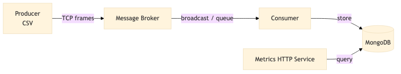
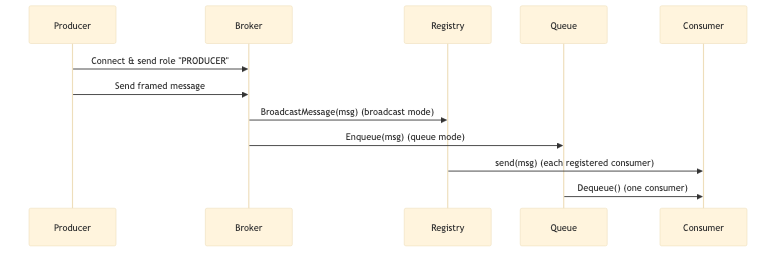

# Message Streaming App — Combined Documentation

Version: 1.0
Date: 2026-02-19

---

## Table of Contents

- Overview
- Services
- High-level Architecture (diagram)
- Message Queue Service — Detailed Architecture
- Metrics API — Detailed Documentation
- Environment Variables (per service)
- User Flow
- OpenAPI / Swagger
- How to run

---

## Overview

Message Streaming App is a lightweight message streaming example consisting of:

- a TCP `message-queue` broker that accepts producers and consumers,
- `producer` that streams CSV metrics into the broker,
- `consumer` that receives messages and persists telemetry into MongoDB,
- `metrics` HTTP service (Gin) to query telemetry and expose API docs.

The system emphasizes clarity: simple framing protocol for reliable message boundaries, flexible delivery modes (broadcast or queue), and a REST API for querying persisted telemetry.

## Services

- `message-queue` — TCP broker (entrypoint: `cmd/message_queue`).
- `producer` — CSV producer (entrypoint: `cmd/producer`).
- `consumer` — Consumer that writes to MongoDB (entrypoint: `cmd/consumer`).
- `metrics` — Gin-based HTTP metrics API (entrypoint: `cmd/metrics`).
- `mongodb` — External datastore for telemetry (not included in repo).

## High-level Architecture



Detailed message-queue flow: 

---

## Message Queue Service — Detailed Architecture

Location: `internal/broker`

### Purpose

The broker accepts TCP connections from producers and consumers. The first line sent by a client must be either `PRODUCER` or `CONSUMER` (followed by `\n`). Producers stream framed messages; consumers receive messages according to broker delivery mode.

### Key Components

- `Broker` (`broker.go`): accepts connections, reads client role, delegates to producer/consumer handlers.
- `BroadcastRegistry` (`consumer_registry.go`): manages a map of consumers (channel per consumer) and broadcasts messages to all registered consumers.
- `MemoryMessageQueue` (`memory_queue.go`): buffered in-memory FIFO queue used in `queue` delivery mode.
- `protocol` package (`internal/protocol`): implements length-prefixed framing (reader/writer helpers) to ensure message boundaries.
- `FrameReader` / `FrameWriter`: adapters for reading/writing frames over network connections.

### Delivery Modes

- `broadcast`: Each registered consumer receives every message. Consumer channels have a buffer (`CONSUMER_CHANNEL_BUFFER_SIZE`). If a consumer channel is full, messages may be dropped with a warning.
- `queue`: Messages are enqueued in a buffered in-memory queue; consumers dequeue messages. When the queue is full, `Enqueue` fails and the message is dropped.

### Configuration (env vars)

- `DELIVERY_MODE` — `broadcast` or `queue` (default: `broadcast`).
- `TCP_PORT` — TCP listener port (default: `9080`).
- `HTTP_PORT` — HTTP port for health checks (default: `8080`).
- `MAX_CONSUMERS` — size hint for registry (default: `10`).
- `CONSUMER_CHANNEL_BUFFER_SIZE` — per-consumer buffer size (default: `10000`).

### Reliability & Scaling Notes

- Current broker is in-memory and single-node. For high reliability.
- To scale horizontally, run multiple broker instances behind a load balancer or migrate to a distributed message system.

---

## Metrics API — Detailed Documentation

Base path: `/api/v1`

### Authentication

- Optional bearer token via `Authorization: Bearer <token>`. The token value is configured with `AUTH_TOKEN` environment variable in the `metrics` service. If `AUTH_TOKEN` is empty, auth is disabled.

### Endpoints

1) GET `/api/v1/gpus`

- Summary: Returns a paginated list of GPU IDs.
- Query params:
  - `limit` (int) — default `DEFAULT_PAGE_SIZE`.
  - `page` (int) — default `1`.
  - `sort` (string) — `asc` or `desc`.
- Response 200: `ListResponse` — JSON with `total`, `page`, `limit`, `items` (array of GPU IDs).

2) GET `/api/v1/gpus/{id}/telemetry`

- Summary: Returns paginated telemetry records for GPU `id`.
- Path param: `id` (string).
- Query params:
  - `start_time` (RFC3339 string, optional)
  - `end_time` (RFC3339 string, optional)
  - `limit`, `page`, `sort` same as above.
- Response 200: `QueryResponse` — JSON with `total`, `page`, `limit`, `items` (array of telemetry objects).

### Health endpoints

- GET `/healthz` — 200 OK (liveness).
- GET `/ready` — 200 OK (readiness).

### Examples

List GPUs:

```sh
curl -H "Authorization: Bearer ${AUTH_TOKEN}" "http://localhost:8080/api/v1/gpus?limit=20&page=1"
```

### Kubernetes Deployment — Details

- **Deployed components**: `message-queue` (TCP broker), `producer` (CronJob), `consumer` (Deployment), `metrics` (Deployment + Service), `mongodb` (StatefulSet). The Helm chart is under [charts/message-streaming-app](charts/message-streaming-app).

- **Producer CronJob (when it wakes up)**: By default the producer CronJob runs every 5 minutes. The schedule is defined in the Helm values: [charts/message-streaming-app/values.yaml](charts/message-streaming-app/values.yaml) (`producer.schedule`). The CronJob template is at [charts/message-streaming-app/templates/producer-cronjob.yaml](charts/message-streaming-app/templates/producer-cronjob.yaml).

  - Default schedule: `*/5 * * * *` (every 5 minutes).
  - Concurrency and parallelism are controlled via `producer.concurrencyPolicy`, `producer.parallelism` and `producer.completions` in values.yaml.

  - To change the schedule at deploy time:

```sh
helm upgrade msa charts/message-streaming-app --install \
  --set producer.schedule="0 * * * *"  # run at top of each hour
```

- **How to scale services**

  - Via Helm values (recommended for reproducible deploys): set `*.replicaCount` (for `consumer`, `messageQueue`, `metrics`, `mongodb`) or enable/adjust HPA values and run `helm upgrade`.

```sh
# scale consumer replicas to 3 and adjust HPA
helm upgrade msa charts/message-streaming-app --install \
  --set consumer.replicaCount=3 \
  --set consumer.hpa.enabled=true \
  --set consumer.hpa.minReplicas=2 \
  --set consumer.hpa.maxReplicas=10
```

  - With `kubectl` (immediate, ad-hoc):

```sh
kubectl scale deployment message-streaming-app-consumer --replicas=3
kubectl scale deployment message-streaming-app-message-queue --replicas=3
kubectl scale deployment message-streaming-app-metrics --replicas=2
```

  - Create/adjust Horizontal Pod Autoscaler (HPA): the chart includes HPA options for `consumer` (see `consumer.hpa` in values). You can also create HPA directly:

```sh
kubectl autoscale deployment message-streaming-app-consumer --cpu-percent=50 --min=1 --max=10
```

- **Important notes when scaling**

  - `message-queue` is an in-memory broker. Running multiple replicas may require sticky sessions or an external load balancer and does not provide shared in-memory state. For production-scale durability and ordering, run a distributed message system (e.g. Kafka, NATS) or ensure brokers coordinate state externally.

  - `consumer` semantics depend on `DELIVERY_MODE` (see `message-queue` section above):
    - `broadcast`: every consumer receives every message — scaling consumers increases parallel processing but duplicates messages to each replica.
    - `queue`: consumers share work; increasing replicas increases throughput by parallel consumption.

  - `mongodb` is deployed as a StatefulSet in the chart. Scaling MongoDB requires configuring a proper replica set and ensuring storage and backup considerations are met. Do not scale MongoDB StatefulSet blindly without setting up replication.

- **Troubleshooting / tips**

  - To change a single value temporarily without modifying values files:

```sh
helm upgrade msa charts/message-streaming-app --install --set producer.schedule="*/1 * * * *"
```

Get telemetry:

```sh
curl -H "Authorization: Bearer ${AUTH_TOKEN}" "http://localhost:8080/api/v1/gpus/gpu-1/telemetry?GPU-016f5163-a200-f674-2110-97949df1c49a"
```


Query telemetry:

```sh
curl -H "Authorization: Bearer ${AUTH_TOKEN}" "http://localhost:8080/api/v1/gpus/gpu-1/telemetry?start_time=2025-07-18T13:00:00Z&end_time=2025-07-18T14:00:00Z"
```

### Schema summary

- `ListResponse`:
  - `total` (int)
  - `page` (int)
  - `limit` (int)
  - `items` ([]string)

- `QueryResponse`:
  - `total` (int)
  - `page` (int)
  - `limit` (int)
  - `items` ([]object)

---

## Environment Variables (per service)

Content is taken from `.env.example`.

### message-queue

- `DELIVERY_MODE` (broadcast|queue) — default `broadcast`
- `TCP_PORT` — default `9080`
- `HTTP_PORT` — default `8080`
- `MAX_CONSUMERS` — default `10`
- `CONSUMER_CHANNEL_BUFFER_SIZE` — default `10000`

### producer

- `BROKER_ADDR` — `host:port` (default `localhost:9080`)
- `CSV_PATH` — path to CSV file

### consumer

- `BROKER_ADDR` — broker address
- `MONGODB_URI` — MongoDB connection string
- `MONGODB_DATABASE` — DB name (default `message_streaming`)
- `MONGO_COLLECTION` — collection name (default `metrics`)

### metrics

- `METRICS_PORT` — HTTP port (default `8080`)
- `MONGODB_URI`, `MONGODB_DATABASE`, `MONGO_COLLECTION` — MongoDB settings
- `AUTH_TOKEN` — optional bearer token; empty disables auth
- `DEFAULT_PAGE_SIZE` — default pagination limit (default `100`)

---

## User Flow

1. Producer reads CSV and connects to broker (`BROKER_ADDR`) and identifies as `PRODUCER`.
2. Producer streams framed messages (length-prefixed) over TCP.
3. Broker receives frames and, depending on `DELIVERY_MODE`:
   - `broadcast`: forwards message to all registered consumers via per-consumer channel.
   - `queue`: enqueues message in a FIFO queue for consumers to dequeue.
4. Consumer(s) connect to broker as `CONSUMER` and receive messages; the consumer persists messages into MongoDB.
5. Metrics service queries MongoDB to return lists of GPUs and telemetry via REST endpoints.

---

## OpenAPI / Swagger

- The repo includes a Makefile target `generate-openapi` which runs `swag` to generate API docs. The metrics service serves the generated `openapi.yaml` at `/openapi.yaml` and exposes Swagger UI at `/swagger/index.html`.

Regenerate OpenAPI with:

```sh
make generate-openapi
```

Swagger UI (when running metrics on default port 8080):

```
http://localhost:8080/swagger/index.html
```

---

## How to run locally without kubecluster(quick)

```sh
# build binaries
make build

# run broker
./bin/message-queue

# run metrics (example)
METRICS_PORT=8080 MONGODB_URI=mongodb://localhost:27017 ./bin/metrics

# run producer
BROKER_ADDR=localhost:9080 CSV_PATH=internal/data/dcgm_metrics_20250718_134233.csv ./bin/producer

# run consumer (stores to MongoDB)
MONGODB_URI=mongodb://localhost:27017 ./bin/consumer
```

## How to deploy on kubenetes cluster
- clone git repo on your local. 
 ```NOTE: Make sure it is clone and not a downloaded repo. As git hashes would be required for image tagging.```

### Prerequistes
Make sure Docker is installed. 

NOTE:
As this depedency is not installed as part of this installation. It may corrupt your existing setups.

Following tools would be setup on your machine per requirements
 - Helm
 - Kind 
 - yq
 - envsubst

 Make sure to create valid environemental values for each purpose.
   - DOCKER_PASSWORD(required for new docker image push)
   - DOCKER_USERNAME (required for docker image pull/pushes)
   - REGISTRY(required to push/pull images)
 
 ### Command to build and push docker images to registery

 ```
 make docker-push-all
 ```

 ### Command to deploy application
 ```
 make deploy
 ```

 This command will perform following steps:
 - check if kind is installed, install if not already installed.
 - create a kube cluster with name kind-cluster using config from ./kind/config.yaml
 - Build the docker images with git hash as tag
 - Push docker images to mentioned registory.
 - run helm upgrade command with appropriate values
 - wait for the kube deployment to be complete
 - return swagger url of the metrics service to use the apis

 ### Prompts

 Please read [Here](ai_usage/prompts.md)
