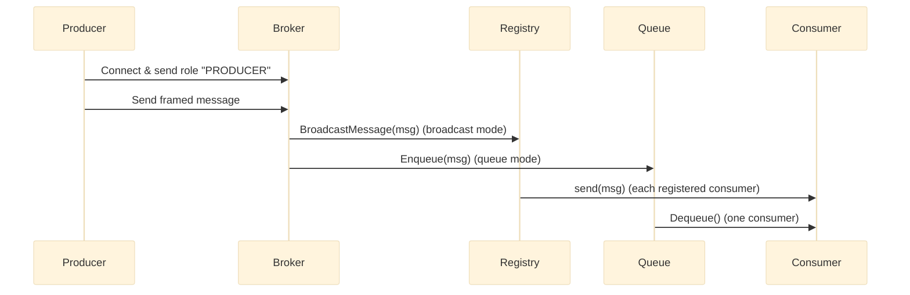

# Message Queue Service Architecture

This document details the internals and configuration of the `message-queue` service (Broker).

## Overview

The broker accepts TCP connections from two types of clients:

- Producers: send frames of messages to the broker.
- Consumers: receive messages from the broker.

The broker supports two delivery modes:

- `broadcast`: every registered consumer receives each message (pub/sub style).
- `queue`: messages are enqueued and consumers dequeue messages in FIFO order.

## Components

- `Broker` (`internal/broker/broker.go`): orchestrates connections, reads the role identifier and routes connections to producer/consumer handlers.
- `BroadcastRegistry` (`internal/broker/consumer_registry.go`): keeps a map of consumer channels for broadcast mode. Registers/unregisters consumers and iterates to push messages.
- `MemoryMessageQueue` (`internal/broker/memory_queue.go`): an in-memory buffered channel used for queue mode.
- `protocol` package (`internal/protocol`): handles framing (length-prefixed frames) for safe, delimited messages over TCP.
- `FrameReader`/`FrameWriter`: adapters that read/write frames to/from network connections.

## Data flow

## Configuration and env variables

- `DELIVERY_MODE` — `broadcast` or `queue` (default: `broadcast`).
- `TCP_PORT` — port for TCP connections (default: `9080`).
- `HTTP_PORT` — port for health endpoints (default: `8080`).
- `MAX_CONSUMERS` — capacity for consumer registry (default: `10`).
- `CONSUMER_CHANNEL_BUFFER_SIZE` — per-consumer channel buffer (default: `10000`).

These are available in `.env.example`.

## Capacity and backpressure

- Broadcast mode pushes messages onto consumer channels. If a consumer channel is full, the message is dropped and a warning is logged. This is a deliberate trade-off for simplicity; production systems should implement backpressure or persistence.
- Queue mode uses a buffered channel; when the queue is full `Enqueue` returns an error and the message is dropped.

## Reliability and persistence

Current implementation is in-memory. For persistence and delivery guarantees, replace `MemoryMessageQueue` with a durable queue (e.g., RabbitMQ, Kafka, or a persisted RocksDB-backed queue).

## Health endpoints

- `/healthz` and `/ready` — simple HTTP endpoints served by the broker for liveness/readiness probes.

## Scaling

- Multiple broker instances are not directly coordinated in this architecture. To scale, run multiple brokers and use a fronting load balancer for producers and consumers, or migrate to a distributed message system.

## Security

- The TCP broker has no built-in authentication. For production, add TLS at the transport layer and token-based authentication for producers/consumers.

## Deployment notes

- Dockerfile located at `dockerfiles/message_queue/Dockerfile`.
- Helm chart under `charts/message-streaming-app` contains templates for deploying the broker along with other components.
